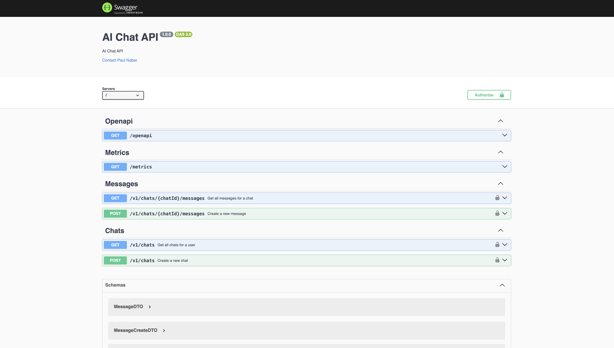

# AI Chat Proxy Server - node.js

This project is an AI Chat Proxy Server that handles chat and message functionalities.
The main focus of this project is the architecture. I want to compare it with other technologies and languages.

## Other Languages and Technologies

[AI Chat Proxy Server - Golang](https://github.com/paulnaber/ai-chat-service-go) <br>
Java...

## Features

- Supports chat and message operations
- OpenAPI documentation generated from code using annotations
- Authentication with OAuth2 Provider
- Downloadable OpenAPI definition (as json)
- Easy local setup with Docker Compose
- Metrics with Prometheus

## Tech Stack

- tsoa - Defining routes with annotation style patterns, also generate OpenAPI Spec from code
- Express.js - Lightweight and flexible routing
- Drizzle ORM - Database interactions with a type-safe and modern approach
- Docker Compose - Simplified local database setup, Prometheus, Keycloak
- Jest, SuperTest - Integration tests
- Prometheus - Metrics
- Keycloak - Authentication, Authorization

### Getting Started

0. Before getting started make sure to

```
add .env file (see .env.example)
have oauth2 provider up and running
have postgres up and running
have node installed on your machine (if nvm -> run nvm use)
```

1. Install dependencies:

```bash
npm install
```

2. Build tsoa:

```bash
npm run tsoa
```

3. Build app:

```bash
npm run tsc
```

3. Start app:

```bash
npm run start
```

for development run:

```bash
npm run dev:watch
```

### Swagger

http://localhost:3000/swagger-ui/



### How to run integration tests

This will start the docker-compose with the .env.test file, run migrations (also with .env.test) and run the test with jest.

```bash
npm run test:e2e
```

### Keycloak

http://localhost:8080/

update the local realm

```bash
docker exec -it container bin/bash
cd /opt/keycloak
bin/kc.sh export --users realm_file --dir realms
docker cp container:/opt/keycloak/realms .

```

get a token for the keycloak admin user

```bash
node ./getToken.mjs
```

### TODOs

- tryCatch function
- more integration tests
- better logs, maybe only log errors in error handler
- more metrics
- grafana
- opensearch dashboard for logs
- proper mocked keycloak setup
- production setup
- kafka
